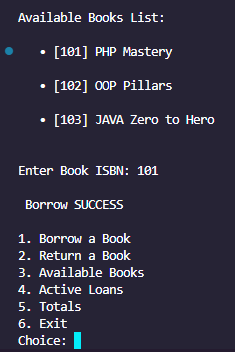
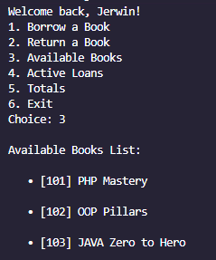
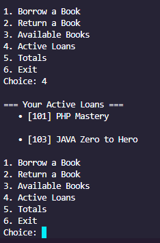
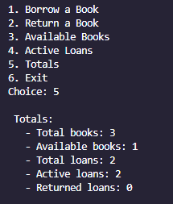

# ojt-php-oop-library

Mini Library System (PHP CLI)

A PHP CLI application demonstrating the core pillars of Object-Oriented Programming (OOP) through a library management scenario. The system features a login-based session, book borrowing/returning logic.

Folder Structure

OjtPhpOopLibrary/
├── src/
│ ├── Book.php # Encapsulation
│ ├── Member.php # Abstraction & Inheritance
│ ├── StudentMember.php # Inheritance
│ ├── RegularMember.php # Inheritance
│ ├── Borrowable.php # Interface (Polymorphism)
│ ├── Loan.php # Composition Object
│ └── Library.php # Controller (Composition & Polymorphism)
├── index.php # Interactive Entry Point
└── README.md # Documentation

How to Run

1. Ensure PHP is installed (v8.0 or higher recommended).

2. Navigate to the project directory using your terminal/command prompt.

3. Execute the following command:

   php index.php

OOP Concepts Mapping

This project proves the implementation of the following concepts:

Encapsulation - Book Class: Uses private properties ($isAvailable). Data is only accessible through public getters and modified via controlled setters (setAvailability).

Abstraction - Member Class: Defined as abstract. It cannot be instantiated and forces child classes to implement the canBorrow() logic.

Inheritance - Student & Regular Member: Both classes extend Member, inheriting common properties (Name, ID) while specializing their own borrow limits.

Polymorphism - Library Class: Implements the Borrowable interface. It treats different member types (Student/Regular) uniformly through the Member type hint.

Composition - Library Class: "Has-a" relationship with Loan objects. The Library manages the lifecycle of these objects in a private array $loans."

Exceptions - Error Handling: Uses try-catch blocks to handle business logic failures (e.g., borrowing an unavailable book or exceeding limits) without crashing.

Sample Output
A) Action Logs

B) Available Books List

C) Active Loans

D) Totals (System Summary)

